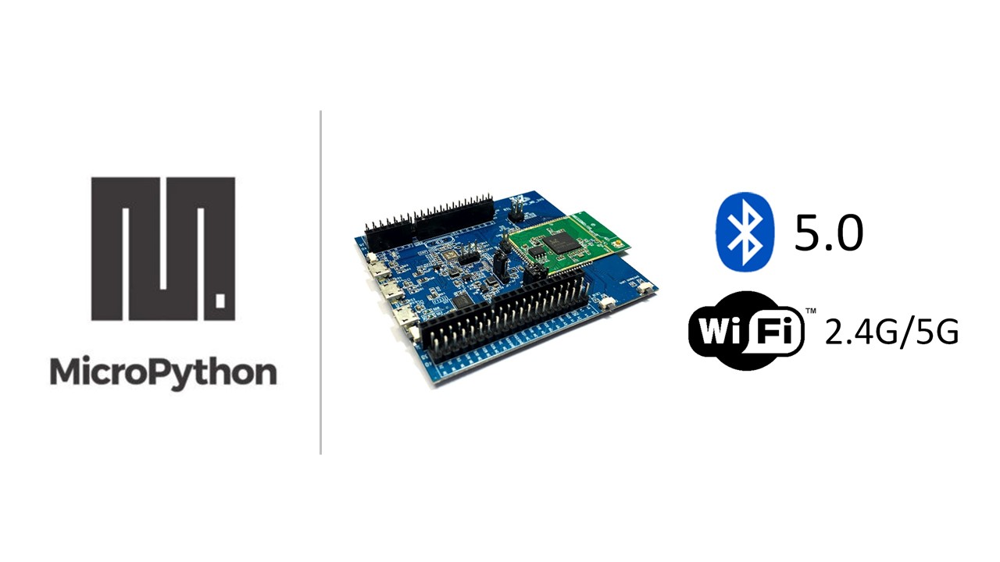

.. amebaDocs documentation master file, created by
   sphinx-quickstart on Fri Dec 18 01:57:15 2020.
   You can adapt this file completely to your liking, but it should at least
   contain the root `toctree` directive.

Welcome to amebaDocs's documentation!
=====================================
This is the Ameba MicroPython online documentation
|image1|

.. toctree::
   :maxdepth: 2
   :caption: Table of Contents:
   
   getting_started/index
   download/index
   examples/index
   board_hdk/index
   api_documents/index
   resources/index
   support/index   

Search
==================

* :ref:`search`

